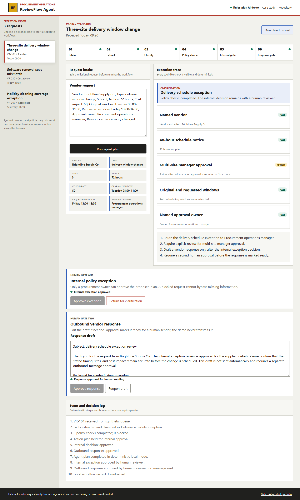
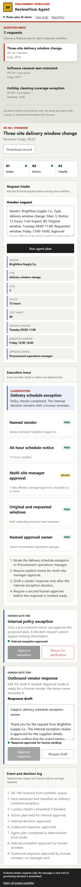

# ReviewFlow Agent

ReviewFlow Agent is a rules-plus-AI vendor exception workflow for procurement operations. It extracts request facts, classifies the exception, runs visible policy checks, proposes an action plan, and requires two separate human decisions before a response is considered ready.

[Live demo](https://jubjub-cpu.github.io/reviewflow-agent/) | [Case study](docs/CASE_STUDY.md) | [Architecture](docs/ARCHITECTURE.md) | [Release notes](docs/RELEASE_NOTES.md)

## Business Problem

Vendor schedule, invoice, and coverage exceptions arrive as messy text. Coordinators manually identify missing details, check policies, route approvals, draft responses, and preserve a decision trail. ReviewFlow makes those stages visible without pretending that the browser acts autonomously.

## Target User

A procurement operations manager reviewing vendor delivery, service, and invoice exceptions.

## Complete Workflow

1. Choose or edit one of three fictional requests.
2. Run the deterministic agent plan.
3. Review extracted facts and classification.
4. Inspect pass, review, and blocked policy checks.
5. Review the proposed action plan.
6. Approve or return the internal exception.
7. Edit the response draft.
8. Approve the outbound response separately.
9. Download the local JSON event record.

Blocked requests cannot bypass missing information. No message is ever sent.

## AI Role and Human Control

The demo uses deterministic structured extraction, intent classification, rules-plus-AI orchestration, missing-information detection, planning, and drafting. It is clearly labeled as a simulation. A human owns both the internal exception and outbound response decisions.

## Screenshots





## Local Setup and Testing

No runtime packages or paid API are required.

```powershell
node .\tools\static-server.mjs --port 4186
node .\tests\analysis.test.mjs
powershell -ExecutionPolicy Bypass -File .\tests\validate.ps1 -NodePath (Get-Command node).Source
```

The optional browser suite uses Playwright and can run locally or with `REVIEWFLOW_BASE_URL=https://jubjub-cpu.github.io/reviewflow-agent/` against the deployment.

## Architecture

Synthetic JSON enters pure analysis functions, then a browser state machine renders the intake, six-stage execution strip, policy checks, approval gates, and event export. See [architecture](docs/ARCHITECTURE.md).

## Accessibility, Privacy, and Security

The product uses semantic landmarks, native controls, a skip link, visible focus, status text, reduced-motion support, and responsive layouts. All requests and policies are fictional. Edited text is escaped before rendering. No data, message, credential, or decision leaves the browser.

## Known Limitations

- Fixed fictional policy rules
- Semicolon-delimited extraction format
- No real policy retrieval, identity, persistence, or external integration
- Deterministic drafting rather than a live model
- Not legal, purchasing, or contract advice

## Future Improvements

- Local policy configuration
- Durable signed event storage
- Optional bring-your-own-key adapter
- Webhook handoff after explicit authorization
- Configurable approval roles

## License

MIT. See [LICENSE](LICENSE).
